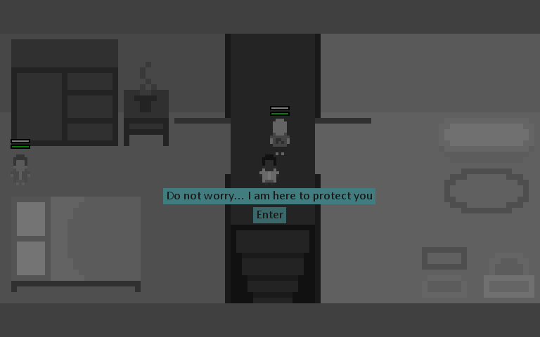

# BAFTA-YGD-2018
Memories - The game I developed when I was 16 for BATFA YGD
I was surpised to see that 90% of the code was stored in one file, a very long 8000 lines of code. Now opting for a modular structure in my programs, this is insane to look back on, but it's nice to see the progress I've made since I started. After all, this was the very first game I had developed from beginning to end!

##Requirements
- Pygame

